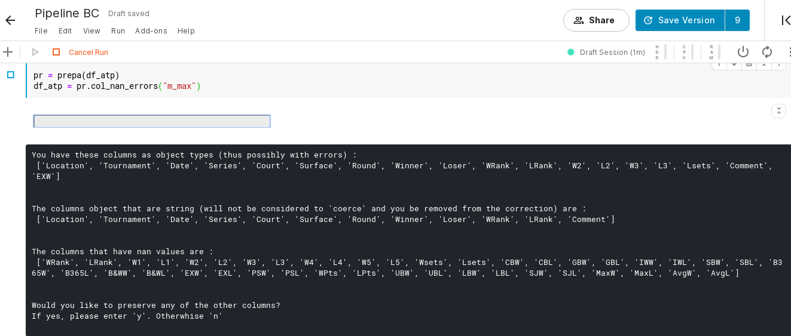

# mlpipelines

This repository is to automate and facilitate your job with machine learning models!! 
It is made within notebooks to interact with the user while exploring and doing data cleansing and getting perfomrance  of pre-built ml models (So far it's built only for Binary Classificaiton and uses 2 models: lightGBM and DNN).

Although not with fancy visualization, it may help the users with low coding experience.

# data cleansing ane feature engineering

*import prepa as pr*

You can get your NaN values and transform then with the class *prepa*:

*pr = prepa(df_atp)*

call the *col_nan_errors(mode)* to transforme your NaN columns with the *m_max* or *m_min* value of each colum

*df_atp = pr.cols_nan_errors("m_max")*

Select columns to be categorized and generate new features:

Here we are selecting columns 0 up to 9 plus the columns "Loser"

See the results right after:

# Running binary classification algorithm

Libraries to be used running your data analyses algorithms with a more user friendly interface.

User input for the model parametrization is allowed through an interative process.

Import the library:

*import binclass as bc*

call the BinaryClass(dataframe,target)

*res = bc.BinaryClass(df,"Labels")*

train your models and get the outputs:

*res.train_models(False,1)*

Get the confusion matrix and AUC & ROC curves at the same place:

Make your data analyses, change them and rerun it:

*res.train_models(False,2)*

(here we are also running a DNN algorithm, that you can choose to run or not)

# Visualize SHAP values to explain your models

SHAP values are an interesting way to explain why your model is doing the predictions in some way. For more documentation: [SHAP documentation](https://shap.readthedocs.io/en/latest/)

Get the most important features:

Check SHAP values for single predictions (why your model chose to predict "1" instead of "0")

Visualize the overall predictions of multiple samples:

